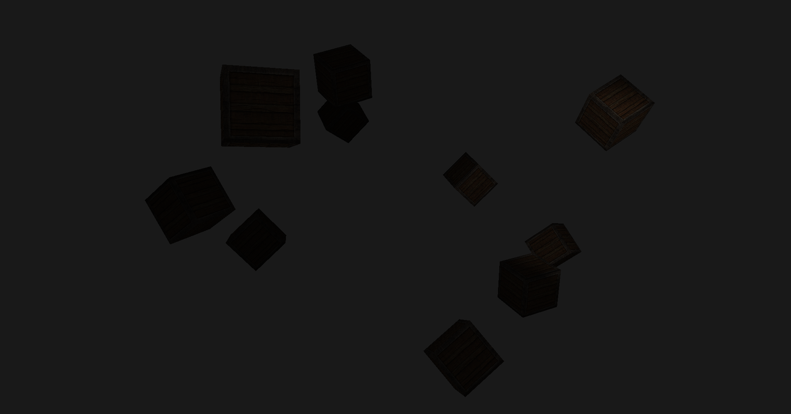

# OpenGL 

Learning modern OpenGL in C++.

## Features

- Ambient Lighting
- Diffuse Lighting
- Specular Lighting (Phong)
- Materials
- Textured Cubes
- Camera Movement
- GLSL Shaders
- Light Maps
- Light Casters
- Model Loading
## Technologies

- C++
- OpenGL
- GLFW
- GLAD
- GLM
- stb_image

## Current Progress

- ✅ Phong Lighting
- ✅ Materials
- ✅ Multiple Light Sources
- ✅ Model Loading
- ⏳ Shadow Mapping

## Screenshot

## Learning Resources

- https://learnopengl.com/
